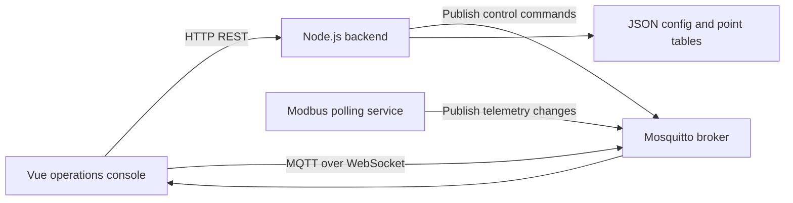
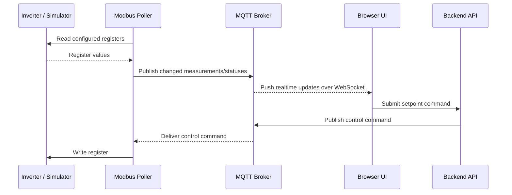

# Communication Architecture: HTTP, WebSocket, and MQTT

This project combines three communication paths: HTTP for configuration, MQTT for telemetry/control events, and WebSocket transport so the browser can subscribe to broker topics.

## Component Graph



## Protocol Responsibilities

| Protocol | Used For | Why |
| --- | --- | --- |
| HTTP REST | Configuration, point-table management, system commands | Request/response semantics and simple admin workflows. |
| MQTT | Telemetry updates, status changes, setpoint commands | Lightweight event stream between field services and UI. |
| WebSocket | Browser MQTT transport | Browsers cannot open raw MQTT TCP sockets. |
| IEC 60870-5-104 | SCADA forwarding interface | Exposes mapped measurements, statuses, and controls to upstream systems. |

## Data Flow



## Topic Shape

Use separate topic families for measurements, statuses, and controls. The exact topic names are defined in `server/services/mqttService.js` and `web/src/utils/mqtt.js`.

Recommended convention:

```text
telemetry/yc/change      # measurement changes
telemetry/yx/change      # status changes
control/yt/command       # setpoint commands
system/health            # service health and diagnostics
```

## Operational Notes

- The UI uses HTTP for durable state and MQTT for live state.
- The backend owns validation before publishing control commands.
- The Modbus service translates point-table indexes into device register reads/writes.
- IEC 104 exposes the same realtime store through a SCADA-compatible protocol surface.
