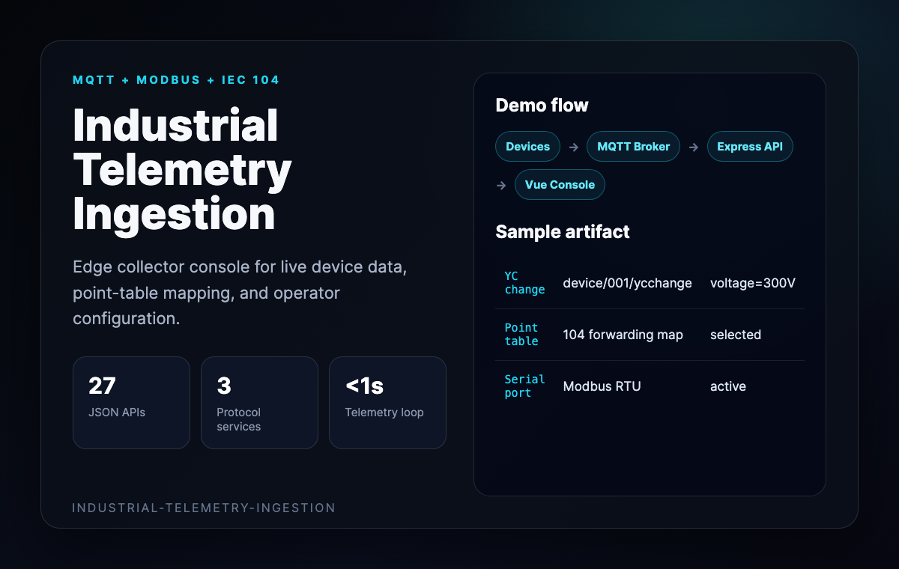
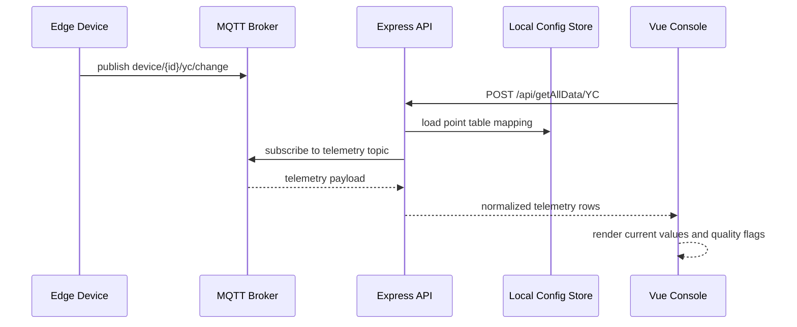
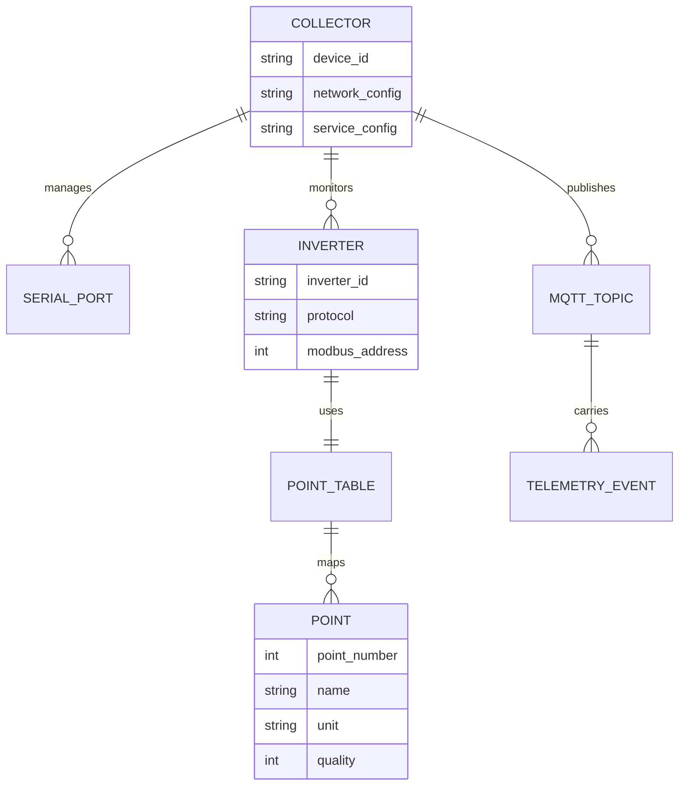
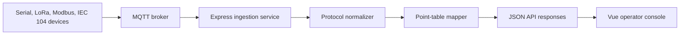

# Industrial Telemetry Ingestion Demo

This walkthrough presents the repo as a real-time data ingestion and operator
console for edge collection units.



## Sequence Diagram



## Entity Graph



## Flow Chart



## Sample Telemetry Payload

```json
{
  "device_id": "data_collector_001",
  "topic": "device/001/yc/change",
  "timestamp": "2026-01-15T14:30:25.123Z",
  "inverters": [
    {
      "inverter_id": "inv_001",
      "yc_data": [
        {
          "ycnum": 1,
          "name": "voltage",
          "value": 300.0,
          "unit": "V",
          "quality": 1
        }
      ]
    }
  ]
}
```
