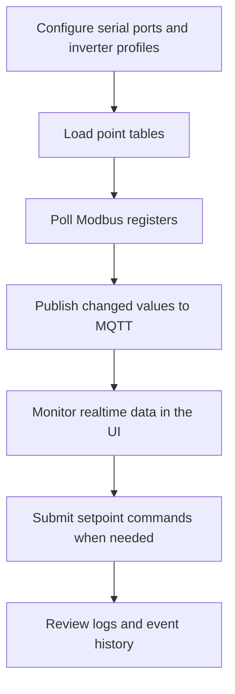

# Deployment and Usage Guide

This guide covers local development, gateway deployment, and day-to-day operation for the industrial telemetry ingestion console.

## Repository Layout

```text
server/   Node.js API, MQTT integration, Modbus polling, IEC 104 service
web/      Vue + Element Plus operations console
tools/    Modbus simulator and hardware test helpers
docs/     Architecture notes, demo walkthroughs, and test guides
```

## Local Development

Install backend dependencies:

```bash
cd server
npm install
npm run dev
```

Install frontend dependencies:

```bash
cd web
npm install
npm run dev
```

Run Mosquitto locally if you want live MQTT updates:

```bash
mosquitto -c /path/to/mosquitto.conf
```

## Gateway Deployment

1. Copy the repository to the gateway, for example `/opt/industrial-telemetry-ingestion`.
2. Install Node.js 18 and build dependencies for native serial modules.
3. Install and configure Mosquitto with MQTT and WebSocket listeners.
4. Run `npm install` in `server/` and build the frontend if serving static assets from the backend.
5. Start the backend with a process manager such as `systemd` or `pm2`.

Example service command:

```bash
cd /opt/industrial-telemetry-ingestion/server
node app.js
```

## Configuration Files

| File | Purpose |
| --- | --- |
| `server/data/config.json` | Collection intervals, server options, log settings, and IEC 104 settings. |
| `server/data/network.json` | Gateway network configuration shown in the UI. |
| `server/data/serials.json` | Serial device paths, baud rates, parity, and protocol mode. |
| `server/data/inverters.json` | Inverter instances mapped to serial ports and protocol profiles. |
| `server/data/inverter-tables/*.json` | Modbus point tables for each inverter model. |
| `server/data/104-tables/*.json` | IEC 104 forwarding tables. |

## Operating Workflow



## Admin Console

The console supports:

- Network, serial, LoRa, and system configuration.
- Inverter profile management.
- Device point-table and IEC 104 forwarding-table management.
- Realtime measurement/status monitoring.
- Setpoint command submission.
- System status and restart controls.

## Safety Notes

- Verify point-table mappings before issuing control commands.
- Use a simulator before connecting to production hardware.
- Keep MQTT broker access restricted in real deployments.
- Treat gateway network restart and service restart actions as operationally disruptive.
